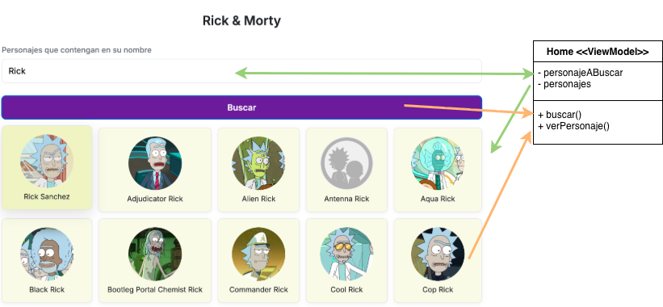

# 📺 Personajes: Rick y Morty

[](https://github.com/uqbar-project/eg-personajes-pelela/actions/workflows/ci.yml)

## 🚀 Cómo ejecutarlo

Como de costumbre:

```bash
pnpm install
pnpm dev
```

Abrí tu navegador e ingresá a [http://localhost:5173](http://localhost:5173) para ver la aplicación funcionando en vivo.

## 🔎 Búsqueda de personajes

En este ejemplo vemos cómo hacer llamadas asincrónicas a un origen de datos.

### Página inicial

La página inicial nos permite iniciar una búsqueda:



- Escribimos un nombre de personaje, que tiene un binding directo con `personajeABuscar` del viewModel
- Luego presionamos el botón "Buscar", lo que dispara el evento `buscar` en el ViewModel...
- el método buscar es _async_, porque **es una operación que puede tardar lo suficiente para bloquear el event loop**. Entonces se define como método pausable...
- cuando volvemos de esa llamada (mediante el _await_) almacenamos el resultado en `personajes`...
- que está asociado a un `for-each` de los personajes, para mostrar una imagen y el nombre

Dejamos el código que dispara la búsqueda que es bastante sencillo:

```ts
  async buscar(): Promise<void> {
    this.personajes = await personajeService.buscarPersonaje(this.personajeABuscar)
  }
```

## Navegación hacia la vista de detalle

Podemos hacer click sobre un personaje para ver más información. Para eso, necesitamos definir un evento `click` sobre el div:

```html
<div for-each="personaje of personajes" class="personaje-card" click="verPersonaje">
```

**Como estamos dentro de un for**, el método verPersonaje recibe un objeto con la información del personaje seleccionado:

```ts
  verPersonaje({ personaje }: { personaje: Personaje }) {
    router.navigateTo(`/personaje/${personaje.id}`)
  }
```

Como vemos, Pelela inyecta en el parámetro `personaje` porque es el nombre de la variable iteradora del for. Luego solo hay que tiparlo y pedir la navegación a

```bash
/personaje/2
```

donde `2` es el identificador de nuestro personaje.

## Routing en Pelela

El archivo `routes.ts` nos permite definir un mecanismo de ruteo, es decir, que asociamos un path a un componente Pelela para poder hacer la navegación de nuestra aplicación:

```ts
export const routes: RouteDefinition[] = [
  { path: '/personaje/:identificador', component: VerPersonaje },
  { path: '/', component: Home },
  { path: '*', component: Home },
]
```

En esta definición

- por defecto, la URL raíz (`/`) se asocia al componente Home (recordamos que un componente es una tríada .pelela, .ts y opcionalmente un .css)
- `/personaje/:identificador` representa una ruta donde hay algo fijo `/personaje` y algo dinámico: `/:identificador`, que indica que nos interesa almacenar como variable el valor que nos pasen dentro de esa ruta
- cualquier otra ruta: (`*`) nos lleva al Home. Si por error escribimos `http://localhost:5173/personajines` el router de Pelela nos dirigirá hacia la página home. Esta ruta se suele llamar `wildcard` o `catch-all route` en otras tecnologías.

## Vista de detalle

Cuando iniciamos la vista de detalle, necesitamos

- saber qué personaje estamos viendo, información que tenemos en la ruta
- pero además tenemos que ir a buscar los datos completos del personaje, lo que requiere otra operación asincrónica

```ts
  async initialize() {
    const identificador = Number(router.urlParameters().identificador)
    this.personaje = await personajeService.datosDePersonaje(identificador)
  }
```

Para poder disparar la consulta sin intervención humana Pelela nos ofrece el método initialize, que puede ser sincrónico o asincrónico. En este caso debe ser un método pausable, porque vamos a pedirle la información a la API que está wrappeada (envuelta, decorada) en el service.

## El service

Este componente sirve como punto de entrada para las consultas a la API. No tiene nada raro, simplemente

- conoce la URL de la API de Rick & Morty, la invoca...
- ...y adapta la respuesta a nuestro modelo, que es un Personaje en el que lamentablemente no le pudimos encontrar demasiado comportamiento

```ts
  async buscarPersonaje(personajeBusqueda: string): Promise<Personaje[]> {
    const response = await this.get<CharactersJSON>(
      `${PUBLIC_API_BASE_URL}/${PUBLIC_API_VERSION}/character/?name=${personajeBusqueda}`,
    )
    return response.results.map(toPersonaje)
  }
```

El método get utiliza la biblioteca `fetch` nativa de Node, por lo que no requiere una biblioteca adicional. Podríamos cambiar a `axios` sin mayores esfuerzos, porque tenemos encapsuladas las llamadas en este método que usa generics para poder tipar la respuesta:

```ts
  private async get<T>(url: string): Promise<T> {
    const response = await fetch(url)
    if (!response.ok) {
      throw new Error(`Error al obtener datos de ${url}`)
    }
    return response.json() as Promise<T>
  }
```

> Eventualmente podríamos llevar este método a un archivo aparte si hubiera varios services.

## Manejo de error

Si se fijan en realidad el método `get` es un poco más elaborado, porque tiene un manejo de error:

```ts
  private async get<T>(url: string): Promise<T> {
    let response: Response
    try {
      response = await fetch(url)
    } catch (err) {
      throw new Error('Error de red al consultar el servidor', { cause: err })
    }
    if (!response.ok) {
      const body = await response.text().catch(() => '')
      throw new Error(`Error ${response.status} al obtener datos de ${url}: ${body}`)
    }
    return response.json() as Promise<T>
  }
```

Fíjense que capturamos errores

- en el fetch
- o bien cuando nos trajo la data

pero la envolvemos en un mensaje de más alto nivel, para que en nuestro componente Pelela aquí **sí** capturemos el error para mostrarlo en la pantalla

```ts
  async buscar(): Promise<void> {
    try {
      this.personajes = await personajeService.buscarPersonaje(this.personajeABuscar)
    } catch (error: unknown) {
      console.error(error)
      this.mensajeError = (error as Error).message
    }
  }
```

En nuestro componente Pelela tenemos un div específico para mostrar el error:


Si queremos que se visualice el mensaje de error por un tiempo, podemos aprovechar la función setTimeout, para disparar asincrónicamente el borrado del mensaje de error tras n segundos:

```ts
      ...
    } catch (error: unknown) {
      console.error(error)
      this.mensajeError = (error as Error).message
      setTimeout(() => {
        this.mensajeError = ''
      }, 5000)
    }
```
